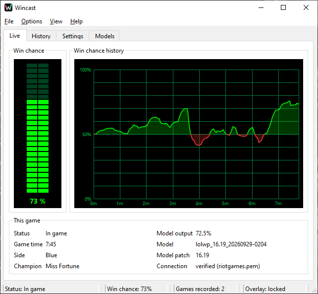
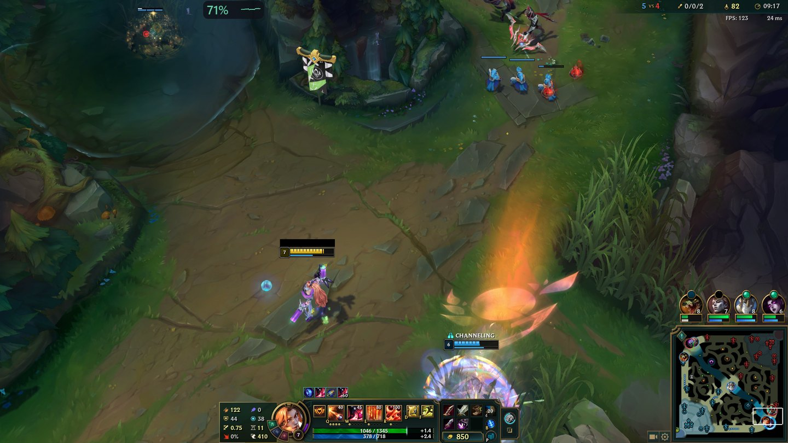
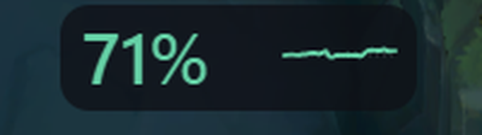
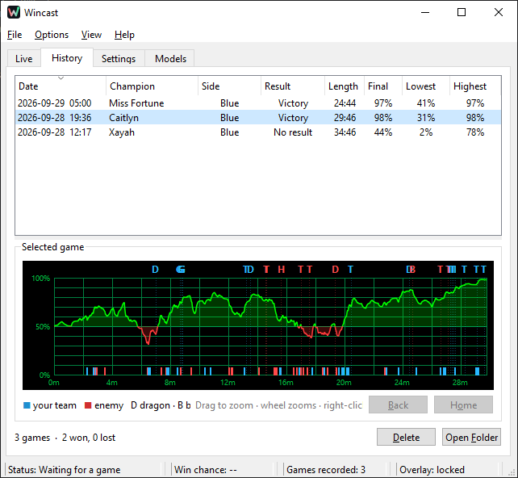
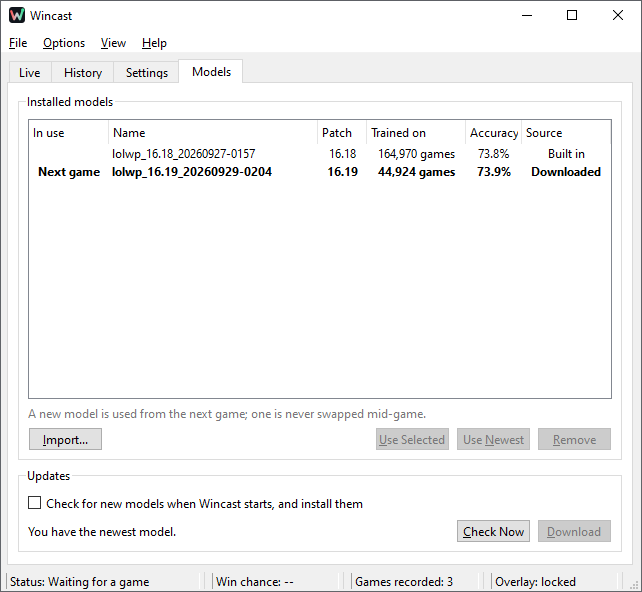

# Wincast

A live win-chance overlay for League of Legends, Summoner's Rift.

* **Local only.** Reads the Live Client Data API that the game itself serves on
  your PC (`https://127.0.0.1:2999`). No Riot API key, no account, no server.
* **Nothing touches the game.** The overlay is an ordinary separate window; it
  never hooks, injects into or reads the memory of the game process.
* **Shows only what you could already see.** The Live Client API exposes the
  same information as the in-game scoreboard; Wincast turns it into one number.

## Screenshots



*The Live tab during a game: the chance dipped below 50% around 4 minutes, then climbed back to 73%.*





*In game, the overlay is a small pill (enlarged above): the chance your team wins, and its trend over the last
10 minutes. It ignores the mouse, so it never gets in the way.*

<p>
  
  
</p>

*Left: every game is saved with its curve, result and objectives by team; drag to zoom in. Right: the models
Wincast has; the next game uses the newest one unless you pin another.*

> Status: early development. Overlay, main window (Live / History / Settings / Models),
> model updates and the .exe work. See [PLANNING.md](PLANNING.md).

## Run it

```bash
pip install -e .[ui,dev]
python -m wincast                  # the overlay: sits in the tray, shows up in game
python -m wincast --replay capture.jsonl.gz --speed 20   # watch a recorded game on the overlay
python -m wincast --headless       # terminal version, same engine
```

**Ctrl+Shift+P** unlocks the overlay so you can drag it; press it again to lock
(click-through). The first launch starts unlocked so you can place it. The tray
icon has the same option and Quit. The game must be in **Borderless** or
Windowed mode. Log file: `%LOCALAPPDATA%\Wincast\wincast.log`.

Riot's certificate (`src/wincast/resources/riotgames.pem`, from
<https://static.developer.riotgames.com/docs/lol/riotgames.pem>) is bundled, so
the connection to the game is verified.

## Releases

* **`v<patch>`** (e.g. `v16.20`, marked Latest): the app, `Wincast-16.20-win64.zip`.
  Built automatically by GitHub Actions when a new patch's models appear, with the
  previous patch's best model built in.
* **`models-<patch>`**: that patch's models, one file per day
  (`model-16.19-20261003-0105.fs1.2.0.json`) plus `SHA256SUMS`. The app finds
  them itself (Models > Check Now); to use a specific day, download it and use
  Models > Import.

Build locally (Windows): `pip install -e .[ui,build]` then
`python tools/build_exe.py --zip`. Unsigned, so SmartScreen asks "Run anyway" once.

## Layout

```
src/wincast/            the app
  client.py             reads the Live Client API (one call per poll)
  session.py            the engine: game detection, scoring, smoothing, curve (no Qt)
  smoothing.py          log-odds moving average over game time
  resolver.py           which model + item prices a new game gets
  models.py             installed models: validate, choose (newest or pinned), import
  updates.py            new models from GitHub Releases (SHA-256 verified)
  worker.py             runs the engine on a background QThread for the UI
  replay.py             plays a saved capture back as if live, at any speed
  headless.py           terminal front end on the same engine
  ui/overlay.py         the click-through pill
  ui/hotkey.py          Ctrl+Shift+P, system-wide (Windows RegisterHotKey)
  ui/tray.py            tray icon: move/lock, quit
  ui/mainwindow.py      the window: Live, History, Settings (Windows 7 Task Manager style)
  ui/charts.py          green-on-black graph and gauge
  history.py            saved games (no names), %LOCALAPPDATA%\Wincast\history
  prefs.py              every setting, its default and limits
  autostart.py          start with Windows (.exe only)
  ui/app.py             wiring; `python -m wincast`
  paths.py              user folders (%LOCALAPPDATA%\Wincast)
  resources/            fallback model + Data Dragon item prices, bundled
src/lolwp/              live scoring code, VENDORED from the model repo -- do not edit
  CORE_MANIFEST.json    source commit + SHA-256 of every vendored file
tools/sync_core.py      re-pulls src/lolwp, the fallback model and the golden game
tools/build_exe.py      PyInstaller build of Wincast.exe (+ zip and SHA256SUMS)
tools/prepare_release.py, fetch_release_model.py   used by the release workflow
.github/workflows/release-app.yml   builds and publishes v<patch> on a Windows runner
tests/                  incl. test_golden.py: a real anonymised game re-scored
scripts/check_no_player_data.py   pre-commit guard (git config core.hooksPath .githooks)
docs/                   Live Client API reference, original design review
```

## Models

The Models tab lists the models Wincast has, and which one the next game uses:
the newest, unless you pin one. New models are published as releases on this
repo (tags `models-<patch>`); **Check Now** finds and installs them, or turn on
the startup check. A model is never swapped mid-game.

## How the model gets here

The model is trained in a separate (private) repo on ranked Summoner's Rift
games. Model files are plain JSON: coefficients and a feature list, never
pickles, never player data. A model built for a different feature set is
refused.

`src/lolwp/` is a byte-for-byte copy of the model repo's live scoring code.
To update it:

```bash
python tools/sync_core.py --check   # has anything drifted?
python tools/sync_core.py           # pull code + current model + golden game
python -m pytest
```

## Privacy

Wincast sends nothing anywhere. Each game it watches is saved on your PC for the
History tab (win-chance curve, result, your champion, objective times by team);
no player names are stored. The only
network requests are Riot's public Data Dragon (item prices, once per patch)
and GitHub, only when you press Check Now or turn on the startup check.

---

Wincast isn't endorsed by Riot Games and doesn't reflect the views or opinions
of Riot Games or anyone officially involved in producing or managing Riot Games
properties. Riot Games and all associated properties are trademarks or
registered trademarks of Riot Games, Inc.
